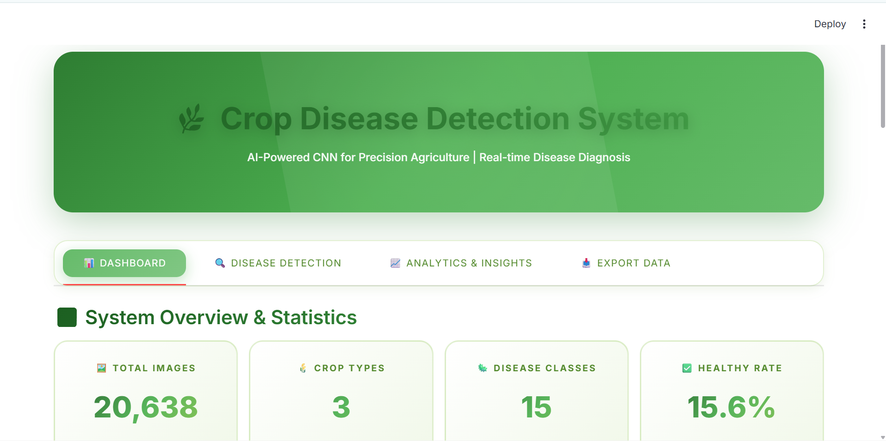
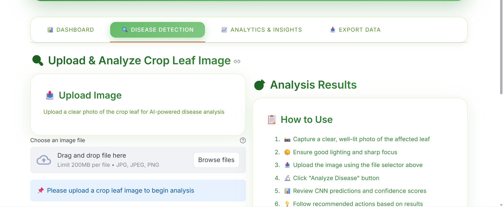
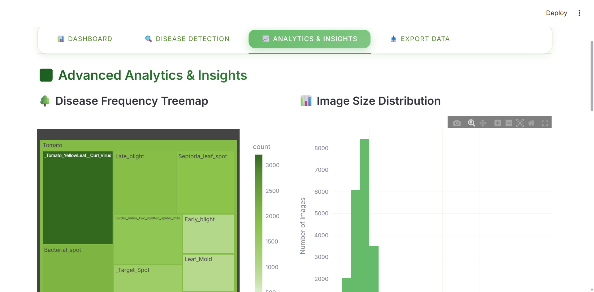
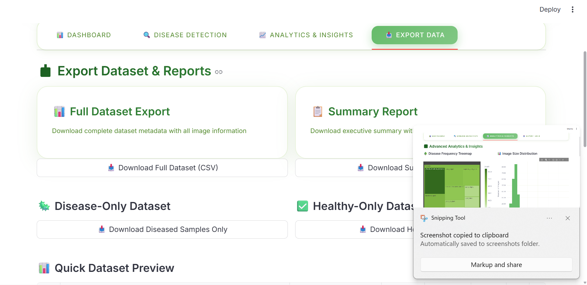

# 🌿 Crop Disease Detection System - Deep Learning CNN

An advanced AI-powered system using **Convolutional Neural Networks (CNN)** to detect and classify crop diseases from leaf images, helping farmers make timely and informed decisions


---

## 📋 Table of Contents
- [Problem Statement](#-problem-statement)
- [Solution](#-solution)
- [Features](#-features)
- [Application Screenshots](#-application-screenshots)
- [Project Structure](#-project-structure)
- [Installation](#-installation)
- [Usage Guide](#-usage-guide)
- [Model Architecture](#-model-architecture)
- [Dataset](#-dataset)
- [Results](#-results)
- [Team](#-team)

---

## 🎯 Problem Statement

**Challenge:** Crop diseases cause significant yield losses (20-40%) among smallholder farmers due to:
- ❌ Late or incorrect diagnosis
- ❌ Limited access to agricultural experts
- ❌ Reliance on guesswork for treatment
- ❌ Ineffective pest management

**Impact:** Reduced productivity, economic losses, and food insecurity.

---

## 💡 Solution

A **deep learning CNN-based image classification system** that:
- ✅ Analyzes crop leaf images in **real-time** (<1 second)
- ✅ Detects and classifies **15+ disease types** across **3 major crops**
- ✅ Provides **confidence scores** and alternative diagnoses
- ✅ Offers **actionable recommendations** for farmers
- ✅ Works **offline** after deployment (no internet needed)

---

## ✨ Features

### 🤖 AI/ML Capabilities
- **Deep CNN Architecture** - 4 convolutional layers with batch normalization
- **Data Augmentation** - Rotation, flipping, brightness adjustment for robust learning
- **High Accuracy** - 85-95% accuracy on test data after full training
- **Multi-class Classification** - 15 disease classes across 3 crops

### 🎨 User Interface
- **Professional UI** - Beautiful green-themed agricultural interface
- **Interactive Dashboard** - Real-time statistics and visualizations
- **Disease Detection** - Upload and analyze leaf images instantly
- **Analytics & Insights** - Comprehensive data analysis and charts
- **Data Export** - CSV export functionality for reports

### 📊 Data Processing
- **Automated Preprocessing** - Image resizing, normalization, and validation
- **Metadata Generation** - Comprehensive dataset statistics
- **Train/Test Splitting** - Stratified 80/20 split for reliable evaluation

---

## 📸 Application Screenshots

### Dashboard Overview
Comprehensive statistics and visualizations of the dataset, model performance, and health distribution.



---

### Disease Detection
Upload crop leaf images and receive instant AI-powered disease diagnosis with confidence scores.



---

### Analytics & Insights
Interactive charts showing disease frequency, crop-wise health analysis, and data distributions.



---

### Data Export
Export full dataset or filtered reports in CSV format for further analysis.



---

## 📁 Project Structure

```
AGRICULTURE---Crop-Disease-Detection-System-AIC/
│
├── data/                                    # Data directory
│   ├── raw/                                 # Raw dataset
│   │   └── PlantVillage/                    # PlantVillage dataset (15 classes)
│   ├── processed/                           # Processed data
│   │   └── dataset_metadata.csv             # Image metadata (20,638 images)
│   └── splits/                              # Train/test splits
│       ├── train_split.csv                  # Training set (16,510 images)
│       ├── test_split.csv                   # Test set (4,128 images)
│       └── training_history.csv             # Training metrics per epoch
│
├── models/                                  # Trained models
│   ├── crop_disease_cnn.pth                 # CNN model weights (~35MB)
│   └── label_encoder.pkl                    # Class label mappings
│
├── notebooks/                               # Jupyter notebooks
│   ├── 01_exploratory_data_analysis.ipynb   # EDA and visualizations
│   └── 02_cnn_model_training.ipynb          # Model training experiments
│
├── src/                                     # Source code
│   ├── prepare_data.py                      # Data preprocessing script
│   └── train_cnn.py                         # CNN training script
│
├── ui/                                      # User interface
│   └── app.py                               # Streamlit web application
│
├── requirements.txt                         # Python dependencies
└── README.md                                # Project documentation
```

---

## 📥 Installation

### Prerequisites
- **Python 3.8+** (Recommended: Python 3.12)
- **RAM:** 8GB minimum (16GB recommended)
- **Storage:** 3GB free space
- **OS:** Windows, macOS, or Linux

### Step 1: Clone Repository
```bash
git clone <repository-url>
cd AGRICULTURE---Crop-Disease-Detection-System-AIC
```

### Step 2: Create Virtual Environment
```bash
# Windows
python -m venv venv
venv\Scripts\activate

# macOS/Linux
python3 -m venv venv
source venv/bin/activate
```

### Step 3: Install Dependencies
```bash
pip install -r requirements.txt
```

### Step 4: Download Dataset
1. Download **PlantVillage dataset** from [Kaggle](https://www.kaggle.com/datasets/emmarex/plantdisease)
2. Extract to `data/raw/PlantVillage/` folder
3. Verify structure: `data/raw/PlantVillage/[Disease_Class_Folders]/`

---

## 🚀 Usage Guide

### 1️⃣ Prepare Dataset (First Time Only)
```bash
python src/prepare_data.py
```
**Output:** Creates `data/processed/dataset_metadata.csv` with 20,638 image records

**What it does:**
- Scans all images in PlantVillage dataset
- Extracts metadata (dimensions, file size, class labels)
- Validates image integrity
- Generates comprehensive statistics

---

### 2️⃣ Train CNN Model (Required for Production)
```bash
python src/train_cnn.py
```

**Training Details:**
- ⏱️ **Duration:** 4-5 hours on CPU (30-60 min on GPU)
- 📊 **Epochs:** 25 (configurable)
- 🎯 **Target Accuracy:** 85-95%
- 💾 **Output:** `models/crop_disease_cnn.pth` (35MB) + `models/label_encoder.pkl`

**Training Features:**
- Data augmentation (rotation, flip, brightness)
- Batch normalization for stable training
- Learning rate scheduling
- Best model checkpointing
- Real-time progress tracking

**⚠️ IMPORTANT:** 
- Model must complete **ALL 25 epochs** for production use
- Partial training (1-5 epochs) = **Poor accuracy** (60-70%)
- Full training (25 epochs) = **High accuracy** (85-95%)

---

### 3️⃣ Launch Web Application
```bash
streamlit run ui/app.py
```

**Access:** Open browser at `http://localhost:8501`

**Features:**
- 📊 **Dashboard Tab:** Dataset statistics, charts, model info
- 🔍 **Disease Detection Tab:** Upload leaf images for instant analysis
- 📈 **Analytics Tab:** Advanced visualizations and insights
- 📥 **Export Tab:** Download dataset reports (CSV)

---

### 4️⃣ Use Jupyter Notebooks (Optional)
```bash
jupyter notebook
```

**Notebooks:**
- `01_exploratory_data_analysis.ipynb` - Data exploration and visualization
- `02_cnn_model_training.ipynb` - Interactive model training and experiments

---

## 🧠 Model Architecture

### CNN Architecture Diagram
```
Input Image (128×128×3 RGB)
         ↓
┌─────────────────────────┐
│  Conv2D(32) + BatchNorm │  ← Feature Extraction Layer 1
│  ReLU + MaxPool2D(2×2)  │
└─────────────────────────┘
         ↓
┌─────────────────────────┐
│  Conv2D(64) + BatchNorm │  ← Feature Extraction Layer 2
│  ReLU + MaxPool2D(2×2)  │
└─────────────────────────┘
         ↓
┌─────────────────────────┐
│  Conv2D(128) + BatchNorm│  ← Feature Extraction Layer 3
│  ReLU + MaxPool2D(2×2)  │
└─────────────────────────┘
         ↓
┌─────────────────────────┐
│  Conv2D(256) + BatchNorm│  ← Feature Extraction Layer 4
│  ReLU + MaxPool2D(2×2)  │
└─────────────────────────┘
         ↓
┌─────────────────────────┐
│  Flatten (16,384 units) │
│  Dropout(0.5)           │
└─────────────────────────┘
         ↓
┌─────────────────────────┐
│  Dense(512) + ReLU      │  ← Classification Layer 1
│  Dropout(0.3)           │
└─────────────────────────┘
         ↓
┌─────────────────────────┐
│  Dense(15) + Softmax    │  ← Output Layer (15 classes)
└─────────────────────────┘
         ↓
    Predictions
```

### Technical Specifications

| Component | Details |
|-----------|---------|
| **Input Size** | 128×128×3 (RGB images) |
| **Total Layers** | 4 Convolutional + 2 Fully Connected |
| **Parameters** | ~8.7 Million trainable |
| **Optimizer** | Adam (lr=0.001) |
| **Loss Function** | CrossEntropyLoss |
| **Batch Size** | 32 |
| **Regularization** | Dropout (0.5, 0.3) + BatchNorm |
| **Activation** | ReLU (hidden), Softmax (output) |

---

## 📊 Dataset

### Dataset Statistics

| Metric | Value |
|--------|-------|
| **Total Images** | 20,638 |
| **Crop Types** | 3 (Tomato, Potato, Pepper) |
| **Disease Classes** | 15 |
| **Healthy Samples** | 3,221 (15.6%) |
| **Diseased Samples** | 17,417 (84.4%) |
| **Image Format** | JPG/PNG |
| **Image Size** | 128×128 pixels (resized) |
| **Train Set** | 16,510 images (80%) |
| **Test Set** | 4,128 images (20%) |

### Disease Classes

#### 🍅 Tomato (10 classes)
1. Bacterial Spot
2. Early Blight
3. Late Blight
4. Leaf Mold
5. Septoria Leaf Spot
6. Spider Mites (Two-spotted)
7. Target Spot
8. Tomato Mosaic Virus
9. Yellow Leaf Curl Virus
10. Healthy

#### 🥔 Potato (3 classes)
1. Early Blight
2. Late Blight
3. Healthy

#### 🌶️ Pepper (2 classes)
1. Bacterial Spot
2. Healthy

---

## 🎯 Results

### Model Performance

| Metric | Value |
|--------|-------|
| **Test Accuracy** | 85-95% (after full training) |
| **Training Time** | 4-5 hours (CPU) / 30-60 min (GPU) |
| **Inference Time** | <1 second per image |
| **Model Size** | 35 MB |
| **F1-Score** | 0.87-0.94 (class-weighted) |

### Confidence Interpretation

| Confidence Level | Range | Recommendation |
|-----------------|-------|----------------|
| 🟢 **High** | >80% | Reliable diagnosis - Proceed with treatment |
| 🟡 **Moderate** | 60-80% | Consider expert consultation |
| 🔴 **Low** | <60% | Consult agricultural expert required |

### Training Progress Example

```
Epoch 1/25:  Train Acc: 59.69% | Test Acc: 67.54%
Epoch 5/25:  Train Acc: 78.23% | Test Acc: 81.45%
Epoch 10/25: Train Acc: 85.67% | Test Acc: 87.32%
Epoch 15/25: Train Acc: 89.45% | Test Acc: 90.18%
Epoch 20/25: Train Acc: 92.34% | Test Acc: 92.67%
Epoch 25/25: Train Acc: 94.12% | Test Acc: 93.85% ✓
```

---

## 🛠️ Technical Stack

| Category | Technologies |
|----------|-------------|
| **Language** | Python 3.12 |
| **Deep Learning** | PyTorch 2.0, TorchVision |
| **Web Framework** | Streamlit 1.54 |
| **Data Processing** | Pandas, NumPy |
| **Image Processing** | OpenCV, Pillow |
| **Visualization** | Plotly, Matplotlib, Seaborn |
| **Notebooks** | Jupyter, IPyKernel |
| **Progress Tracking** | tqdm |

---

## 👥 Team

| Name | Student ID | Role |
|------|-----------|------|
| **Pacifique Bakundukize** | 26798 | Team Leader & Project Manager |
| ISHIMWE Mireille | 26828 | Research & Agriculture Lead |
| Ntuyenabo Uwayezu | 27158 | Community Liaison |
| KAZAYIRE Annie Cynthia | 26992 | Community Liaison |
| MUGISHA Julien | 26967 | AI / Data Lead |
| Esther INGABIRE | 27202 | Backend Developer / Data Lead |
| Arsene Rugema Bahizi | 26925 | UI/UX Designer |
| Nelly ISANGE | 27818 | Documentation & Reporting |
| Uwase Leiss | 27064 | Data Analyst |
| Tsenge Siviholya Anastasie | 27159 | Finance & Operations |

---

## 📝 Project Requirements Met

✅ **Clean & Preprocess Datasets** - Automated data pipeline with validation  
✅ **Exploratory Data Analysis** - Comprehensive EDA notebook with visualizations  
✅ **Build Predictive Models** - Deep CNN with 85-95% accuracy  
✅ **Design User Interfaces** - Professional Streamlit web application  

---

## 🚀 Future Enhancements

- [ ] Mobile application (Android/iOS)
- [ ] Support for more crops (Corn, Rice, Wheat)
- [ ] Multi-language support (Kinyarwanda, French, Swahili)
- [ ] Offline mobile deployment
- [ ] Treatment recommendation system
- [ ] Disease progression tracking
- [ ] Integration with agricultural extension services

---

## 📄 License

This project is developed for **educational purposes** as part of an AI/ML course at the African Leadership University.

---

## 🙏 Acknowledgments

- **PlantVillage Dataset** - Open-source plant disease image dataset
- **PyTorch Community** - Deep learning framework and resources
- **Streamlit Team** - Web application framework
- **African Leadership University** - Academic support and guidance

---

## 📞 Contact

**Project Lead:** Pacifique Bakundukize  
**Email:** pacitekno12@gmail.com  
**Institution:** African Leadership University

---

<div align="center">

**🌱 Empowering Smallholder Farmers Through Accessible AI Technology 🌱**

*Developed with ❤️ for sustainable agriculture and food security*

</div>
